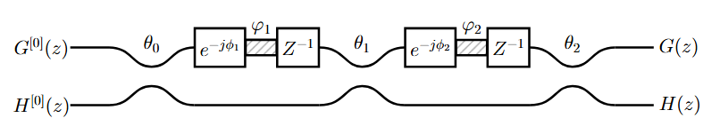

# Lattice Filter Synthesis Tool

## Overview

This repository contains a Python-based software tool designed for the synthesis of $N$-th order $2 \times 2$ Finite Impulse Response (FIR) lattice filters. The implementation focuses on optical filters based on cascaded Mach-Zehnder Interferometers (MZIs), widely used in Silicon Photonics.

The tool implements a systematic algorithm to automate the design process. It computes the necessary coupling coefficients ($\theta_i$) and phase shifts ($\phi_i$) required to achieve a target transfer function, such as Maximally Flat Symmetric (MFS) filters.

This software accompanies the research presented in the paper:
**"A Practical Approach To Design Lattice Filters On Silicon Photonics"**.




## Key Features

* **General Synthesis Algorithm:** Capable of synthesizing lattice filters of arbitrary order $N$.
* **Parameter Extraction:** Automatically calculates the coupling angles and phase delays required for physical implementation on photonic integrated circuits (PICs).
* **Simulation and Analysis:** Includes routines for calculating transfer matrices and plotting frequency responses (magnitude and phase).
* **Scientific Visualization:** Utilizes `scienceplots` and `matplotlib` for publication-quality figures.

## Usage

The primary workflow is demonstrated in the Jupyter Notebook provided in the repository.

1.  **Clone the repository:**
    ```bash
    git clone [https://github.com/Leoopessoa/Lattice-Filter-Synthesis-Tool.git](https://github.com/Leoopessoa/Lattice-Filter-Synthesis-Tool.git)
    cd Lattice-Filter-Synthesis-Tool
    ```

2.  **Launch the Notebook:**
    ```bash
    jupyter notebook Lattice.ipynb
    ```

3.  **Workflow Description:**
    * **Initialization:** The notebook imports the core logic from `Functions.py`.
    * **Synthesis:** Define the desired filter order ($N$) and target specificatio'ns. The notebook **`Lattice.ipynb`** ilustrates the usage with 2nd, 3rd and 4th order examples. 


## Repository Structure

* **`Functions.py`**: The core library containing the implementation of the synthesis algorithm, transfer matrix calculations, and helper functions for signal processing and visualization.
* **`Lattice.ipynb`**: An interactive Jupyter Notebook serving as the main user interface for designing and simulating filters.
* **`dependencies/`**: Folder containing the `requirements.txt` file for environment setup.
* **`A_Practical_Approach_To_Design_Lattice_Filters_On_Silicon_Photonics.pdf`**: The reference paper detailing the mathematical foundation and experimental validation of the algorithm.
* **`README.md`**: Project documentation.

## Citation

If you use this tool in your research, please refer to the associated publication:

> L. P. B. Lacerda, Í. A. Araújo, A. F. Herbster, and M. A. Romero, "A Practical Approach To Design Lattice Filters On Silicon Photonics."

## Contributing
Contributions are welcome! If you have suggestions, bug reports, or improvements, feel free to open an Issue or submit a Pull Request. You may also contact me via email regarding specific changes or proposals.

## Contact

For inquiries regarding the algorithm or the software implementation, please contact the authors:

* **Leonardo Pessoa**: leonardo.lacerda@ee.ufcg.edu.br / leonardopessoa@usp.br